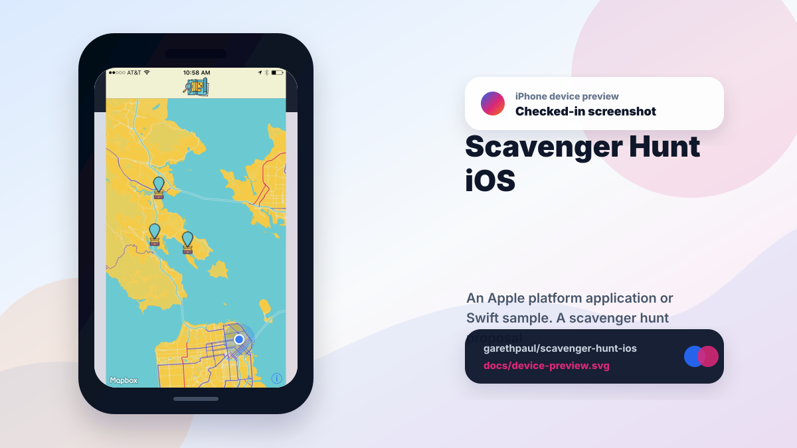

# scavenger-hunt-ios

<!-- README-OVERVIEW-IMAGE -->


## Device Preview

<!-- DEVICE-PREVIEW-IMAGE -->


## Overview

`garethpaul/scavenger-hunt-ios` is an Apple platform application or Swift sample. A scavenger hunt proposal app.

This README is based on the checked-in source, manifests, scripts, and repository metadata on the `master` branch. The project language mix found during review was: Swift (4).

## Repository Contents

- `README.md` - project overview and local usage notes
- `CHANGES.md` - maintenance history for iOS contract checks
- `Makefile` - local verification entry points
- `Podfile` - Apple platform dependency metadata
- `docs/plans` - completed maintenance plans for the current baseline
- `engagement` - source or example code
- `engagementTests` - source or example code
- `engagementUITests` - source or example code
- `plans` - historical implementation notes
- `scripts` - static iOS contract validators
- `Podfile.lock` - Apple platform dependency metadata
- `SECURITY.md` - security reporting and disclosure guidance
- `TreasureHunt.xcodeproj` - Xcode project file
- `VISION.md` - project direction and maintenance guardrails

Additional scan context:

- Source directories: TreasureHunt.xcodeproj, engagement, engagementTests, engagementUITests
- Dependency and build manifests: Podfile, Podfile.lock
- Entry points or build surfaces: TreasureHunt.xcodeproj
- Test-looking files: engagementTests/Info.plist, engagementTests/engagementTests.swift, engagementUITests/Info.plist, engagementUITests/engagementUITests.swift

## Getting Started

### Prerequisites

- Git
- macOS with Xcode for building Apple platform projects
- CocoaPods if dependencies need to be installed

### Setup

```bash
git clone https://github.com/garethpaul/scavenger-hunt-ios.git
cd scavenger-hunt-ios
pod install
cp engagement/MapboxSecrets.xcconfig.example engagement/MapboxSecrets.xcconfig
```

The setup commands above are derived from repository files. Legacy mobile, Python, or JavaScript samples may require older SDKs or package versions than a modern workstation uses by default.

Set `MAPBOX_ACCESS_TOKEN` in Xcode build settings or include the copied
`engagement/MapboxSecrets.xcconfig` in your local configuration. Optionally set
`MAPBOX_STYLE_URL` locally to use a custom Mapbox style; leave it blank to use
Mapbox's default style. Local style URLs are limited to `mapbox` or `https`
schemes, must not embed Mapbox style URL credentials or `access_token` query
parameters, and `mapbox://styles` values require owner and style path
components. Keep real Mapbox tokens and private style URLs out of git. Set your
Apple development team locally in Xcode when building for a device; the checked
in project keeps `DEVELOPMENT_TEAM` blank.

The runtime accepts only bounded public `pk.` tokens and fails closed with a
generic setup message rather than constructing a map with a placeholder, secret
token, control characters, or an oversized value.

GitHub secret scanning still reports one historical Mapbox secret-token alert
from commit `cd55b858f1326c9d6f7952dada0bde68ae0f78a6`. The token is absent from
the current tree, which uses `$(MAPBOX_ACCESS_TOKEN)` plus tracked-file guards,
but repository cleanup cannot prove account-side revocation. Keep the alert open
until the credential owner confirms revocation or rotation. Maintainers must not
retrieve, test, copy, or resolve the historical value based only on current-tree
cleanup.

### Legacy Toolchain Contract

Treat the checked-in build metadata as a historical compatibility contract, not
as a claim that every current Apple toolchain can run the sample unchanged. The
app target is Swift 4 with an iOS 12.0 deployment target. `Podfile.lock` pins
Mapbox iOS SDK 3.1.2 and records CocoaPods 1.1.1 provenance; preserve that lock
file unless a separate dependency-migration change intentionally replaces it.

Run `pod install` without updating dependencies, then open
`engagement.xcworkspace`. The Xcode project records legacy compatibility
metadata and keeps `DEVELOPMENT_TEAM` blank, so select a signing team only in
local Xcode settings. Keep the ignored `engagement/MapboxSecrets.xcconfig`
local and configure only a public `pk.` token, an optional credential-free style
URL, and optional synthetic or reviewed coordinate pairs.

The vendored Mapbox framework contains x86_64 and i386 simulator slices and
armv7, armv7s, and arm64 device slices, but no arm64 simulator slice. The
canonical hosted build therefore uses an unsigned x86_64 simulator target.
Apple Silicon simulator execution requires an Intel-compatible environment;
do not treat an arm64 simulator failure as proof that source or policy tests
failed.

The checked-in map center and prize marker are reviewed public demo fallbacks.
To use a different event location without editing source, set all values in a
pair through local build settings: `MAP_CENTER_LATITUDE` with
`MAP_CENTER_LONGITUDE`, and/or `PRIZE_LATITUDE` with `PRIZE_LONGITUDE`. The app
uses only complete, finite, valid coordinate pairs; missing, unresolved,
non-numeric, out-of-range, or exact `0,0` sentinel settings fall back to the
corresponding demo coordinate. Keep
private event locations in the ignored `MapboxSecrets.xcconfig`. These validated
local coordinate overrides are not logged by the sample. Loading map content
can disclose the viewed region to Mapbox under the SDK and service privacy
terms.

## Running or Using the Project

- Open `engagement.xcworkspace` in Xcode, choose the shared `engagement` scheme,
  and run it on a compatible simulator or locally signed device.

## Simulator And Device Verification

Use [`DEVICE_VERIFICATION.md`](DEVICE_VERIFICATION.md) for one exact commit.
An x86_64 simulator can verify build, launch, local configuration, annotation,
callout, and static map behavior. It cannot establish physical GPS accuracy,
real permission changes, device signing, or location-session behavior on
hardware. Those rows require a locally signed physical device and a synthetic
or reviewed public location fixture.

Never include a Mapbox token, private style URL, signing identity, provisioning
profile, private event coordinate, precise user location, or device identifier
in committed evidence. Keep unavailable rows explicitly `blocked` or `not run`;
a successful build is not annotation, permission, location, or visual evidence.

## Testing and Verification

- `swift test` runs 29 native policy tests without loading the vendored Mapbox
  binary.
- `ruby scripts/check_policy_mutations.rb` verifies 33 hostile policy and
  integration changes are caught.
- `make check` runs static checks for Mapbox token placeholders, asset
  references, safe annotation-image handling, CocoaPods lock consistency, and
  location authorization before map tracking. It also reports whether an Xcode
  build could be attempted locally.
- `make check` also rejects precise user-location coordinate logging.
- `make check` also requires Mapbox user-following mode to be gated on location
  authorization before tracking starts.
- `make check` also requires each location authorization transition to consume
  the delegate-provided status and stop Mapbox follow mode after denial or
  revocation.
- Visible-screen location acquisition stops after one 15-second deadline when
  no acceptable fix arrives, and stale session deadlines cannot stop a newer
  acquisition generation.
- `make check` also requires the app to request location authorization only
  from the undetermined state during initial setup.
- `make check` also rejects always-on location authorization prompts and plist
  usage-description keys.
- `make check` also requires the prize marker to be added only once when the
  view appears repeatedly.
- `make check` also protects validated local coordinate overrides and reviewed
  pairwise demo fallbacks for the map center and prize marker.
- `make check` also verifies the Xcode workspace uses a relative project
  reference, the app scheme is shared, and developer-local `xcuserdata` stays
  untracked.
- `make check` also verifies that account-specific Xcode signing teams stay out
  of the checked-in project file.
- `make check` also requires optional Mapbox style URLs to come from local
  configuration rather than checked-in Swift or plist values.
- `make check` scans tracked non-vendored files for both public and secret
  Mapbox token formats while allowing the local placeholder template.
- `make check` also requires configured Mapbox style URLs to use `mapbox` or
  `https` schemes with valid scheme-specific authorities.
- `make check` also rejects Mapbox style URL credentials, `access_token` query
  parameters, and incomplete `mapbox://styles/<owner>/<style>` paths.
- `make check` also keeps Mapbox attribution and telemetry controls visible and
  rejects the deprecated plist flag that claimed a separate in-app setting.
- GitHub Actions runs the static contract on Ubuntu and the native policy tests
  plus an unsigned x86_64 simulator build on macOS. Both jobs use pinned
  checkout, read-only permissions, disabled credential persistence, and timeouts.
- `VENDORED_FRAMEWORKS.sha256` verifies the checked-in Mapbox framework binary.
- Xcode compilation is opt-in locally with `RUN_LEGACY_XCODE=1`; it uses the
  checked-in Swift 4/iOS 12 baseline and x86_64 simulator architecture required
  by the vendored Mapbox 3.1.2 framework.
- `make root-test` proves every public Make target keeps its repository root,
  shell, Ruby, Swift, and Swift flags under repository control while treating
  Xcode opt-in and derived-data configuration as inert data.
- The static checker also requires completed canonical plans under `docs/plans`.

When the required SDK or runtime is unavailable, use static checks and source review first, then verify on a machine that has the matching platform toolchain.

The application bounds locally supplied tokens and style URLs, but Mapbox owns
tile/style request execution and response parsing inside the vendored SDK. Run
physical-device checks for provider errors, telemetry choice, permission
changes, stale-location recovery, backgrounding, and real GPS accuracy before
using the sample for a private event.

## Configuration and Secrets

- Detected references to Mapbox. Keep API keys, OAuth credentials, tokens, and account-specific values in local configuration only.

## Security and Privacy Notes

- Review changes touching network requests, sockets, or service endpoints; examples from the scan include TreasureHunt.xcodeproj/xcuserdata/gpj.xcuserdatad/xcschemes/xcschememanagement.plist, engagement/Info.plist, engagementTests/Info.plist, engagementUITests/Info.plist.
- Review changes touching mobile permissions or privacy-sensitive device data; examples from the scan include engagement/ViewController.swift.
- Review changes touching file, media, JSON, XML, CSV, OCR, or data parsing; examples from the scan include TreasureHunt.xcodeproj/xcuserdata/gpj.xcuserdatad/xcschemes/xcschememanagement.plist, engagement/Info.plist, engagement/ViewController.swift, engagementTests/Info.plist, and 1 more.

## Maintenance Notes

- This looks like an Apple platform project or sample. Xcode, Swift, CocoaPods, and deployment target versions may need to match the original project era.
- See `SECURITY.md` for vulnerability reporting and safe research guidance.
- See `VISION.md` for project direction and contribution guardrails.
- See `docs/plans/2026-06-08-scavenger-hunt-ios-baseline.md` for the canonical
  Mapbox/iOS contract baseline.
- See `docs/plans/2026-06-08-location-authorization.md` for the location
  permission guard.
- See `docs/plans/2026-06-08-location-log-privacy.md` for the coordinate
  logging privacy guard.
- See `docs/plans/2026-06-09-single-prize-annotation.md` for the duplicate
  prize-marker guard.
- See `docs/plans/2026-06-09-authorized-user-tracking.md` for the
  authorization-gated user-tracking guard.
- See `docs/plans/2026-06-09-when-in-use-location-scope.md` for the
  when-in-use location scope guard.
- See `docs/plans/2026-06-09-shared-xcode-scheme.md` for the shared Xcode
  scheme and workspace portability guard.
- See `docs/plans/2026-06-09-mapbox-style-url-config.md` for the local Mapbox
  style URL configuration guard.
- See `docs/plans/2026-06-09-mapbox-style-url-scheme-guard.md` for the Mapbox
  style URL scheme guard.
- See `docs/plans/2026-06-09-local-signing-team-guard.md` for the local Xcode
  signing-team guard.
- See `docs/plans/2026-06-10-ci-baseline.md` for the GitHub Actions static
  baseline.
- See `docs/plans/2026-06-10-vendored-framework-integrity.md` for the Mapbox
  binary integrity and explicit legacy-build boundary.
- See `docs/plans/2026-06-10-mapbox-style-url-authority.md` for configured
  style URL authority validation.
- See `docs/plans/2026-06-12-mapbox-style-url-credential-path-validation.md`
  for credential-free style URLs and complete Mapbox owner/style paths.
- See `docs/plans/2026-06-12-location-authorization-transitions.md` for the
  status-driven tracking transition contract.
- See `docs/plans/2026-06-12-mapbox-secret-token-guard.md` for the tracked
  Mapbox token formats guard and historical-alert boundary.
- See `docs/plans/2026-06-13-mapbox-attribution-telemetry-controls.md` for the
  required Mapbox attribution and telemetry controls.
- See `docs/plans/2026-06-13-location-request-gating.md` for the initial
  location authorization request boundary.
- See `docs/plans/2026-06-14-make-root-override-protection.md` for the
  caller-resistant, location-independent iOS validation root.
- See `docs/plans/2026-06-21-make-authority-isolation.md` for isolated Make
  authority and hostile-input regression coverage.
- See `docs/plans/2026-06-17-configurable-demo-coordinates.md` for validated
  local coordinate overrides and pairwise demo fallbacks.
- See `docs/plans/2026-06-19-runtime-deep-review.md` for runtime policy, native
  test, mutation, and Xcode evidence.
- See `docs/plans/2026-06-25-mapbox-legacy-setup-guide.md` for the legacy
  credential, toolchain, simulator, and device-verification guide.

## Contributing

Keep changes small and tied to the project that is already present in this repository. For code changes, document the toolchain used, avoid committing generated dependency directories or local configuration, and update this README when setup or verification steps change.
