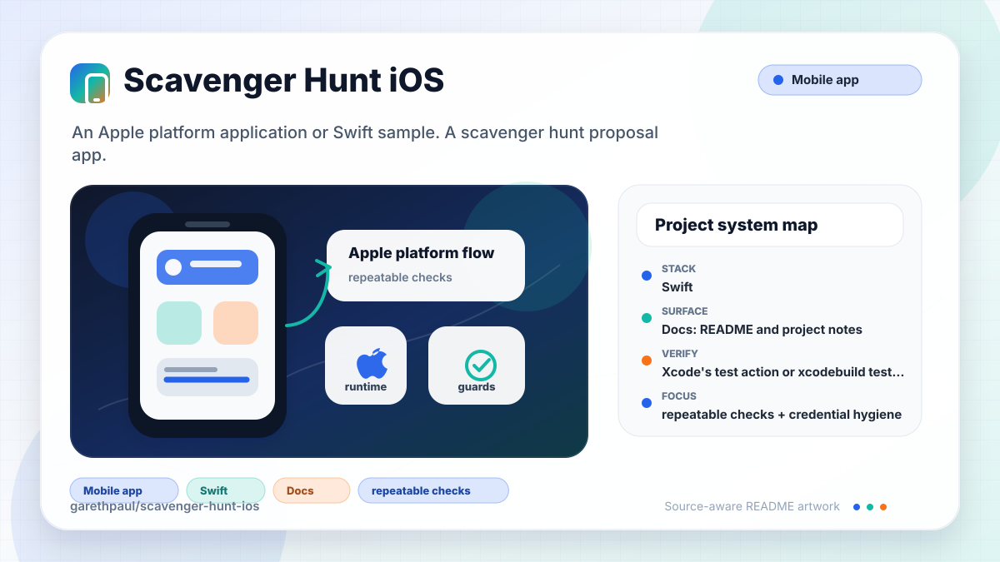

# scavenger-hunt-ios

<!-- README-OVERVIEW-IMAGE -->


## Overview

`garethpaul/scavenger-hunt-ios` is an Apple platform application or Swift sample. A scavenger hunt proposal app.

This README is based on the checked-in source, manifests, scripts, and repository metadata on the `master` branch. The project language mix found during review was: Swift (4).

## Repository Contents

- `README.md` - project overview and local usage notes
- `Podfile` - Apple platform dependency metadata
- `engagement` - source or example code
- `engagementTests` - source or example code
- `engagementUITests` - source or example code
- `Podfile.lock` - Apple platform dependency metadata
- `SECURITY.md` - security reporting and disclosure guidance
- `TreasureHunt.xcodeproj` - Xcode project file
- `VISION.md` - project direction and maintenance guardrails

Additional scan context:

- Source directories: TreasureHunt.xcodeproj, engagement, engagementTests, engagementUITests
- Dependency and build manifests: Podfile, Podfile.lock
- Entry points or build surfaces: TreasureHunt.xcodeproj
- Test-looking files: engagementTests/Info.plist, engagementTests/engagementTests.swift, engagementUITests/Info.plist, engagementUITests/engagementUITests.swift

## Getting Started

### Prerequisites

- Git
- macOS with Xcode for building Apple platform projects
- CocoaPods if dependencies need to be installed

### Setup

```bash
git clone https://github.com/garethpaul/scavenger-hunt-ios.git
cd scavenger-hunt-ios
pod install
cp engagement/MapboxSecrets.xcconfig.example engagement/MapboxSecrets.xcconfig
```

The setup commands above are derived from repository files. Legacy mobile, Python, or JavaScript samples may require older SDKs or package versions than a modern workstation uses by default.

Set `MAPBOX_ACCESS_TOKEN` in Xcode build settings or include the copied
`engagement/MapboxSecrets.xcconfig` in your local configuration. Keep real
Mapbox tokens out of git.

## Running or Using the Project

- Open `TreasureHunt.xcodeproj` in Xcode, choose the app or sample scheme, and run it on the matching simulator/device.

## Testing and Verification

- Xcode's test action or `xcodebuild test` with the appropriate scheme and destination
- `make verify` runs static checks for Mapbox token placeholders, asset
  references, safe annotation-image handling, CocoaPods lock consistency, and
  Xcode build availability.

When the required SDK or runtime is unavailable, use static checks and source review first, then verify on a machine that has the matching platform toolchain.

## Configuration and Secrets

- Detected references to Mapbox. Keep API keys, OAuth credentials, tokens, and account-specific values in local configuration only.

## Security and Privacy Notes

- Review changes touching network requests, sockets, or service endpoints; examples from the scan include TreasureHunt.xcodeproj/xcuserdata/gpj.xcuserdatad/xcschemes/xcschememanagement.plist, engagement/Info.plist, engagementTests/Info.plist, engagementUITests/Info.plist.
- Review changes touching mobile permissions or privacy-sensitive device data; examples from the scan include engagement/ViewController.swift.
- Review changes touching file, media, JSON, XML, CSV, OCR, or data parsing; examples from the scan include TreasureHunt.xcodeproj/xcuserdata/gpj.xcuserdatad/xcschemes/xcschememanagement.plist, engagement/Info.plist, engagement/ViewController.swift, engagementTests/Info.plist, and 1 more.

## Maintenance Notes

- This looks like an Apple platform project or sample. Xcode, Swift, CocoaPods, and deployment target versions may need to match the original project era.
- See `SECURITY.md` for vulnerability reporting and safe research guidance.
- See `VISION.md` for project direction and contribution guardrails.

## Contributing

Keep changes small and tied to the project that is already present in this repository. For code changes, document the toolchain used, avoid committing generated dependency directories or local configuration, and update this README when setup or verification steps change.
